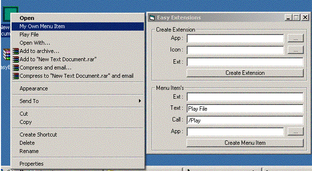



## Easy Extensions

### Description

This Code Shows How To Make Extensions Open With Your Program and how to Retreave the info...

Also it will add R Click menu items to Files With Your Extensions.. VeryShort Code Pretty Simple...

To Retreave the info in Form_load of ur app just Parse Command$ .. Note: Icons will not be shown till restart... Tested in Xp. Timothy Marin www.IntraDream.com.. oh yea some feed back would be cool..
 
### More Info
 

             |
---                |---
**Submitted On**   |2002-12-08 12:51:20
**By**             |[Timothy Marin](https://github.com/Planet-Source-Code/PSCIndex/blob/master/ByAuthor/timothy-marin.md)
**Level**          |Intermediate
**User Rating**    |5.0 (25 globes from 5 users)
**Compatibility**  |VB 6\.0
**Category**       |[Registry](https://github.com/Planet-Source-Code/PSCIndex/blob/master/ByCategory/registry__1-36.md)
**World**          |[Visual Basic](https://github.com/Planet-Source-Code/PSCIndex/blob/master/ByWorld/visual-basic.md)
**Archive File**   |[Easy\_Exten15116512112002\.zip](https://github.com/Planet-Source-Code/timothy-marin-easy-extensions__1-41504/archive/master.zip)

